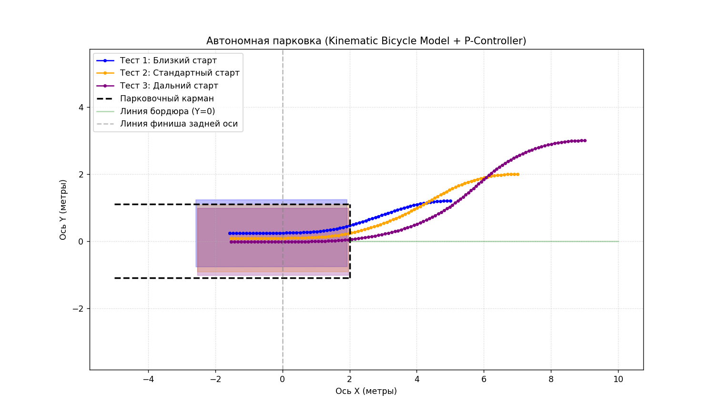

# Simulator of Autonomous Parallel Parking Based on a Kinematic Bicycle Model

Программа для моделирования автоматической парковки автомобиля задним ходом. Проект имитирует реальную физику движения машины, проверяет геометрию кузова на столкновения с границами кармана и автоматически рассчитывает угол поворота руля для точного заезда на парковочное место.


## Результаты валидации алгоритма


*Рисунок 1. Траектории движения центра задней оси и финальные габариты кузова при парковке из различных начальных позиций.*

## Математическое описание модели

В основе физического движка лежит кинематическая модель велосипеда (Kinematic Bicycle Model), которая упрощает четырехколесное шасси до двухколесного эквивалента.

### Уравнения состояния (Численное интегрирование)
Обновление пространственного состояния системы $[x, y, \theta]^T$ на каждом шаге времени $dt$ выполняется методом Эйлера:

$$x_{t+1} = x_t + v \cdot \cos(\theta_t) \cdot dt$$
$$y_{t+1} = y_t + v \cdot \sin(\theta_t) \cdot dt$$
$$\theta_{t+1} = \theta_t + \frac{v \cdot \tan(\phi_t)}{L} \cdot dt$$

*   $v$ — линейная скорость (м/с). Движение назад: $v < 0$.
*   $\phi$ — угол поворота управляющих колес. Конструктивно ограничен: $\phi \in [-30^\circ; 30^\circ]$.
*   $L$ — колесная база ($2.5$ м).

### Определение столкновений (Линейная алгебра)
Для определения пересечения кузова с физическими препятствиями реализован расчет глобальных координат четырех углов автомобиля (Bounding Box). Вычисление производится путем перемножения матрицы 2D-поворота (Rotation Matrix) на векторы локальных координат габаритов относительно центра задней оси:

$$
\begin{bmatrix} x_{global} \\ y_{global} \end{bmatrix} = 
\begin{bmatrix} \cos\theta & -\sin\theta \\ \sin\theta & \cos\theta \end{bmatrix} \times 
\begin{bmatrix} x_{local} \\ y_{local} \end{bmatrix} + 
\begin{bmatrix} x \\ y \end{bmatrix}
$$

Алгоритм проверяет нахождение полученных вершин в запрещенных зонах парковочного кармана, предотвращая проезд сквозь "стены".

## Алгоритм управления (Proportional Controller)

Синтезированный закон управления разделен на две фазы:

1. **Фаза сближения ($x > 2.0$):** Контроллер минимизирует боковое отклонение по оси Y. Формируется уставка желаемого угла, и руль ($\phi$) поворачивается пропорционально рассогласованию текущего и желаемого курсовых углов.
2. **Фаза терминального выравнивания ($x \le 2.0$):** Внутри створа кармана приоритет переключается на стабилизацию угла ($\theta \to 0$), обеспечивая постановку машины строго параллельно границам.

### Геометрические вызовы: Учет динамического габарита кузова

В процессе объединения проверки столкновений и регулятора была выявлена практическая сложность. Сам по себе регулятор рассчитывает траекторию только для одной точки — центра задней оси. Однако реальный автомобиль имеет габариты, и при сильном вывороте колес его передний и задний бамперы описывают более широкие дуги, чем траектория колес. 

Из-за этого эффекта при стартах на близком расстоянии от кармана углы машины могли цеплять виртуальный бордюр еще на этапе разворота. Чтобы решить эту проблему, в симуляторе зона проверки столкновений по оси Y была расширена с 1.1 м до 1.5 м. Это дало необходимый безопасный зазор для выпирающих при маневре бамперов. Для более сложных сценариев в будущем потребуется переход от простого регулятора к полноценному планировщику пути.


## Архитектурные особенности: Single Source of Truth

Для визуализации автомобиля используется паттерн *Single Source of Truth (Единый источник истины)*. 
Стандартные графические примитивы (например, `matplotlib.patches.Rectangle`) имеют собственную логику поворота вокруг базовых точек, что при сложных углах $\theta$ приводит к рассинхронизации между реальным физическим положением (которое видит алгоритм) и картинкой на экране.

Чтобы решить эту проблему, отрисовка реализована через `Polygon`. Математическое ядро симулятора один раз вычисляет точные глобальные координаты 4-х вершин кузова с помощью матриц поворота. Затем этот же массив данных используется **и для системы Collision Detection, и для рендера полигона**. Это гарантирует 100% совпадение графики и расчетов.

## Ограничения модели и направления для улучшения

Текущая версия симулятора является базовым прототипом и имеет ряд ограничений, которые планируется устранить в рамках дальнейшего развития проекта:

1. **Зависимость от начальной ориентации кузова:** Созданный регулятор спроектирован для условий, когда автомобиль стартует параллельно карману ($\theta = 0$). Если развернуть машину под большим углом или поставить задом к финишу, текущие правила управления не справятся. Требуется разработка полноценного планировщика траекторий.
2. **Отсутствие маневрирования в несколько приемов:** Контроллер реализует парковку строго за один непрерывный ход назад. В реальных стесненных условиях робот должен уметь переключать передачу на передний ход («раскачка») для выравнивания в узких местах.
3. **Идеальные физические условия:** Модель не учитывает массу робота, инерцию, задержку в срабатывании приводов руля и возможное проскальзывание колес на мокром или скользком покрытии.
4. **Погрешность численного метода:** Метод Эйлера накапливает ошибку при увеличении времени симуляции или шага времени $dt$. Для долгосрочного прогнозирования траектории необходим переход на более точные методы интегрирования.


## Инструкция по запуску
```bash
# Установка зависимостей
pip install numpy matplotlib

# Запуск симуляции
python parking_sim.py
